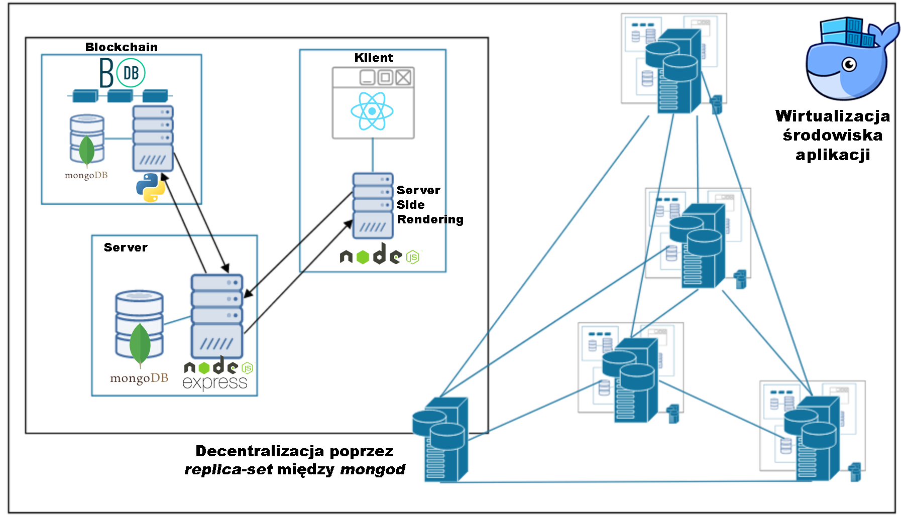

## Blockchain API

Proof of Concept of business blockchain node network. Handcrafted thanks to [BigchainDB](https://github.com/bigchaindb).



#### Disclaimer - State: PoC
App consists of many elements, mostly unfinished, provided just in purpose of legitimating proposed Proof of Concept functionality.

### Solution Concept
Build on [hackathon starter](https://github.com/sahat/hackathon-starter) boilerplate with [Docker](https://www.docker.com/) for simulating blockchain network.

- NodeJS w/ Express,
- MongoDB w/ Mongoose,
- Docker container w/ **BigchainDB** (with separate mongo),
- Babel for missing ES features,
- *GraphQL* [unaccomplished],
- *SocketIO* [unaccomplished],
- *Http/2* [unaccomplished],
- Flow,
- Mocha testing (Sinon, Chai),

## Installation

[BigchainDB - Run with Docker](https://docs.bigchaindb.com/projects/server/en/latest/appendices/run-with-docker.html)

```bash
make start
make start-network

make install # configurates and initializes
```

Rerun and go:

```bash
make restart-bigchaindb
``` 

Valid response with some basic config information should be available under `http://localhost:59984/`.

##### Debugging
**NOTE:** Some errors or configuration outcomes needs explicit restarting of container, don't hesitate to use `make restart-bigchaindb` as first repair step.

```bash
make logs # watch BigchainDB log
```

## Development

Initialize Blockchain environment with Docker

```bash
make # to start main app
make start-network # to start replica-set blockchain network

# if replica-set won't initialize before BigchainDB queries for Primary
make bigchaindb-restart # restart
```

One instance BigchainDB server is used as interchangeable node handler for entire blockchain network (*just for PoC purposes*).

Use commands to switch between base node and node-1:

```bash
make switch-node-initial
make switch-node-1
```

In effect replacing config and restarting BigchainDB, achieving lightweil multinode simulation instead of fully-fledged production-ready network, allowing us to legitimate proposed PoC functionality. 
